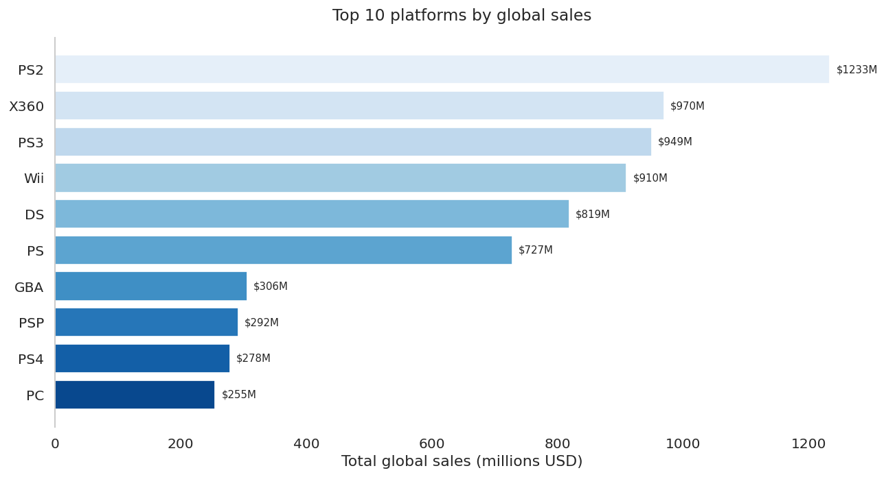
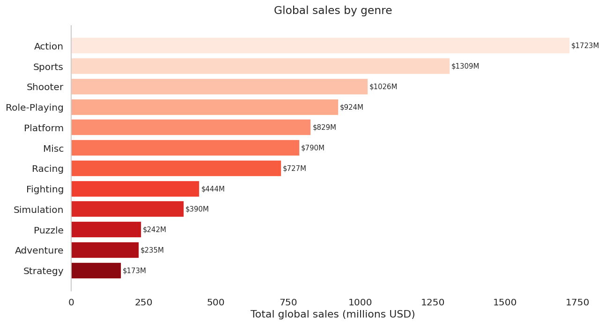
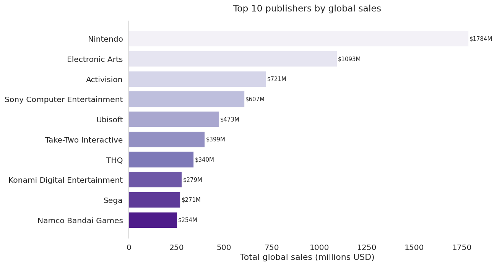
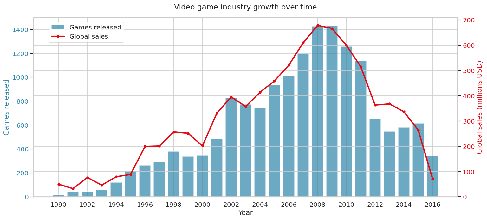
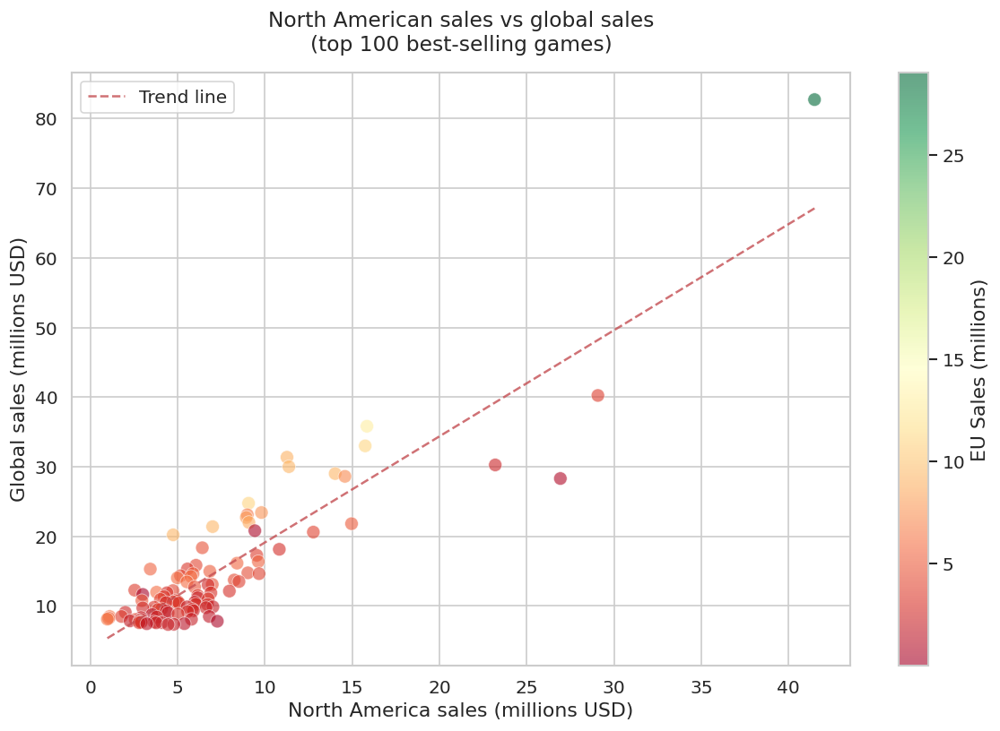
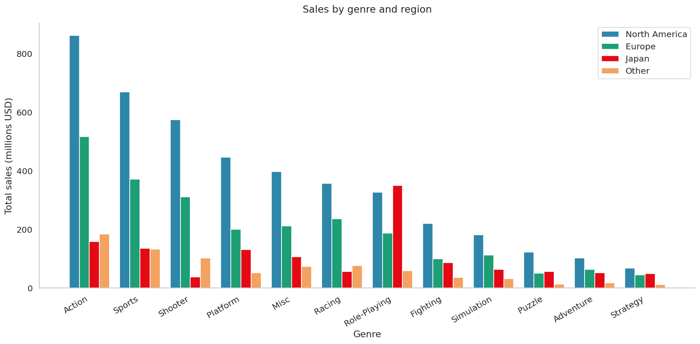
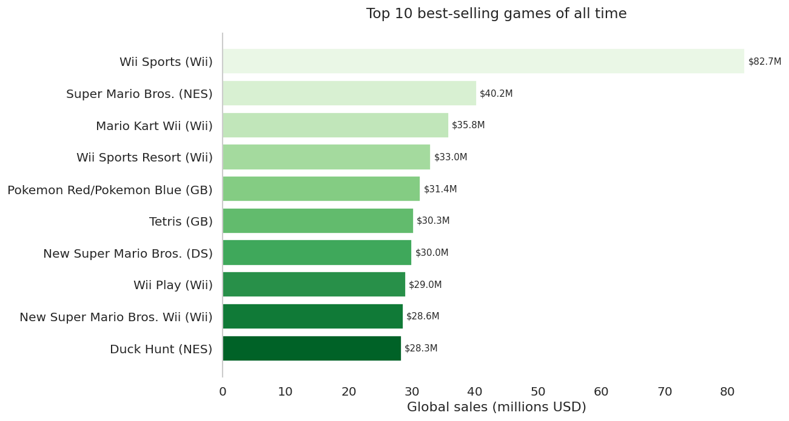

# Video Game Industry Analysis — What Makes a Best-Seller?

**Data Analyst Portfolio Project**  
Hugo Apolinário · 2025


---

## Table of contents
1. [About the project](#about-the-project)
2. [Dataset](#dataset)
3. [Methodology](#methodology)
4. [Key findings](#key-findings)
5. [Business recommendations](#business-recommendations)
6. [How to run](#how-to-run)
7. [Technologies used](#technologies-used)
8. [License](#license)

---

## About the project

The global video game industry has generated billions in revenue across
decades of platform generations, genre evolution, and publisher competition.
But what actually drives a game to the top of the charts?

This project analyses **16,000+ video games** across platforms, genres,
publishers and regions to answer one core business question:

> **What makes a video game a best-seller — and what can publishers
> learn from the data?**

Unlike typical descriptive analyses, every finding here is translated into
a concrete strategic recommendation — the kind of output a data analyst
would deliver to a game studio's product or commercial team.

---

## Dataset

| Property | Detail |
|---|---|
| Source | Video Game Sales (vgsales) |
| Provider | Kaggle (Gregory Smith) |
| Games | 16,598 titles |
| Columns | 11 (name, platform, year, genre, publisher, regional sales) |
| Time range | 1980 – 2016 |
| Link | [Kaggle Dataset](https://www.kaggle.com/datasets/gregorut/videogamesales) |

---

## Methodology

**Data cleaning (Python + Pandas):**
- Removed rows with missing `Year` or `Publisher` values
- Converted `Year` column from float to integer
- Filtered out erroneous future-dated entries (post-2016)
- Reset index after cleaning for clean SQL loading

**SQL analysis (SQLite via Python):**
- Loaded cleaned DataFrame into an in-memory SQLite database
- Wrote 7 structured SQL queries using `SELECT`, `GROUP BY`,
  `ORDER BY`, `ROUND`, `COUNT`, `SUM`, `AVG`, and `LIMIT`
- Used `pd.read_sql()` to execute queries and return results
  as DataFrames for visualisation

**Visualisation:** Python (Matplotlib + Seaborn) — 7 charts including
bar charts, a dual-axis chart, and a scatter plot with trend line.

---

## Key findings

### 1. Top platforms by global sales


The PS2 dominates all-time global sales, followed by the X360 and PS3.
Nintendo platforms (Wii, DS) punch above their weight relative to
game count, suggesting higher average quality per title.

---

### 2. Most profitable genres


Action is the highest-grossing genre globally by a significant margin,
followed by Sports and Shooter. Role-Playing games lead in Japan despite
ranking lower globally — a clear regional preference signal.

---

### 3. Publisher market share


Nintendo dominates global publisher sales despite releasing fewer titles
than competitors — the highest average sales per game of any major
publisher. Electronic Arts leads on volume; Nintendo leads on quality.

---

### 4. Industry growth over time


The industry peaked in sales around 2008–2009 despite game releases
continuing to grow through 2011. This divergence between volume and
revenue signals market saturation — more games, lower average quality.

---

### 5. North America as a predictor of global success


North American sales show extremely strong correlation with global sales
among top-100 titles. A game that succeeds in NA will almost certainly
succeed globally — making NA the bellwether market for launch strategy.

---

### 6. Genre preferences by region


NA and EU share similar genre preferences (Action, Sports, Shooter).
Japan is a clear outlier — Role-Playing games dominate, with Action and
Sports lagging far behind. Publishers targeting Japan need a distinct
genre strategy from their Western approach.

---

### 7. Best-selling games of all time


Wii Sports leads all-time global sales, followed by Grand Theft Auto V
and Super Mario Bros. Nintendo titles occupy 4 of the top 10 spots —
reinforcing the publisher dominance finding from Query 3.

---

## Business recommendations

**1. Prioritise Action for maximum global reach**
Action is the highest-grossing genre across all major markets. Publishers
entering a new market should lead with Action titles to maximise
addressable audience.

**2. NA first — then global**
The extremely high correlation between NA and global sales means
publishers should treat North America as their primary launch market.
Strong NA performance is the clearest predictor of global success.

**3. Japan requires a separate strategy**
Japan's preference for Role-Playing games diverges sharply from Western
markets. Publishers targeting Japan should develop dedicated genre
strategies rather than localising Western titles directly.

**4. Study Nintendo's playbook**
Nintendo generates the highest average sales per game of any major
publisher — achieved through franchise strength, platform exclusivity,
and family-friendly content. Quality over quantity is the proven formula.

**5. Fight market saturation with quality**
Post-2009 data shows rising game releases but falling average sales.
The market rewards fewer, better games. Publishers should resist the
temptation to increase volume at the expense of quality.

---

## How to run

1. Clone this repository
2. Download `vgsales.csv` from
   [Kaggle](https://www.kaggle.com/datasets/gregorut/videogamesales)
   and place it in the root folder
3. Open `vgsales_analysis.ipynb` in JupyterLab
4. Run all cells top to bottom with `Shift + Enter`

**Dependencies:**
```
pip install pandas matplotlib seaborn numpy
```

> SQLite is built into Python — no additional installation needed.

> If using JupyterLite (jupyter.org/try), run this in the first cell:
> ```python
> import micropip
> await micropip.install('seaborn')
> ```

---

## Technologies used

| Tool | Purpose |
|---|---|
| Python 3.10 | Core analysis language |
| SQLite (via Python) | SQL queries on the dataset |
| Pandas | Data cleaning and transformation |
| Matplotlib | Chart creation |
| Seaborn | Chart styling |
| Jupyter Notebook | Analysis environment |

---

## License

This project is licensed under the **MIT License** — see
[LICENSE](LICENSE) for details.  
Dataset: Video Game Sales via Kaggle — public domain.
